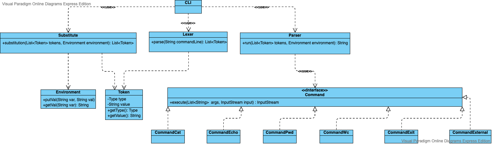

# CLI
Интерпретатор командной строки, поддерживающий следующие команды:
 - cat [FILE] — вывести на экран содержимое файла;
 - echo — вывести на экран свой аргумент (или аргументы);
 - wc [FILE] — вывести количество строк, слов и байт в файле;
 - pwd — распечатать текущую директорию;
 - exit — выйти из интерпретатора
 - Внешние команды  
Также поддерживаются одинарные и двойные кавычки, присвоение и подстановка.   
Входная строка разбирается классом Lexer на токены, после класс Substitute выполняет все подстановки, затем класс Parser исполняет все токены.   
Класс Environment хранит все переменные окружения.  
Интерфейс Command, позволяет добавлять новые команды. Выполняет команду с переданными аргументами и InputStream'ом, и выводит результат в  InputStream.  

